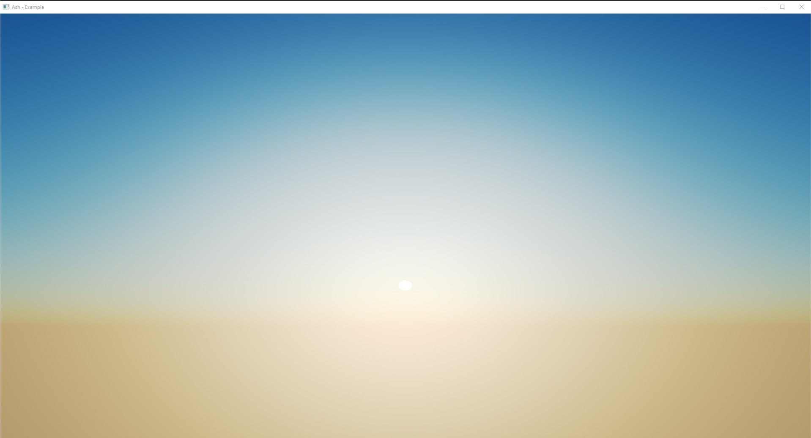

# 🐉 Rust GPU

[](https://embark.dev)
[](https://discord.gg/dAuKfZS)
[](https://embarkstudios.github.io/rust-gpu/api/rustc_codegen_spirv)
[](https://deps.rs/repo/github/EmbarkStudios/rust-gpu)
[](https://github.com/EmbarkStudios/rust-gpu/actions)

This is a very early stage project to make Rust a first-class language and ecosystem for building GPU code 🚀🚧

### Current Status: v0.3

Compiling and running very simple shaders works, and a significant portion of [the core library](https://doc.rust-lang.org/core/index.html) also compiles.

However, many things aren't implemented yet: for example, loops and switches aren't supported yet! That means that while being technically usable, this project is far from being production-ready.

### Example



```rust
use glam::{Vec3, Vec4, vec2, vec3};

#[spirv(fragment)]
pub fn main(
    #[spirv(frag_coord)] in_frag_coord: &Vec4,
    #[spirv(push_constant)] constants: &ShaderConstants,
    output: &mut Vec4,
) {
    let frag_coord = vec2(in_frag_coord.x, in_frag_coord.y);
    let mut uv = (frag_coord - 0.5 * vec2(constants.width as f32, constants.height as f32))
        / constants.height as f32;
    uv.y = -uv.y;

    let eye_pos = vec3(0.0, 0.0997, 0.2);
    let sun_pos = vec3(0.0, 75.0, -1000.0);
    let dir = get_ray_dir(uv, eye_pos, sun_pos);

    // evaluate Preetham sky model
    let color = sky(dir, sun_pos);

    *output = tonemap(color).extend(1.0)
}
```

See [source](examples/shaders/sky-shader/src/lib.rs) for full details.

## Getting started

Check out [The `rust-gpu` Dev Guide][gpu-guide] for information on how to get started with using it in your projects.

[gpu-guide]: https://embarkstudios.github.io/rust-gpu/book/


## Background

Historically in games GPU programming has been done through writing either HLSL, or to a lesser extent GLSL. These are simple programming languages that have evolved along with rendering APIs over the years. However, as game engines have evolved, these languages have failed to provide mechanisms for dealing with large codebases, and have generally stayed behind the curve compared to other programming languages.

In part this is because it's a niche language for a niche market, and in part this has been because the industry as a whole has sunk quite a lot of time and effort into the status quo. While over-all better alternatives to both languages exist, none of them are in a place to replace HLSL or GLSL. Either because they are vendor locked, or because they don't support the traditional graphics pipeline. Examples of this include CUDA and OpenCL. And while attempts have been made to create language in this space, none of them have gained any notable traction in the gamedev community.

Our hope with this project is that we push the industry forward by bringing an existing, low-level, safe, and high performance language to the GPU; namely [Rust](https://rust-lang.org). And with it come some additional benefits that can't be overlooked: a package/module system that's one of the industry's best, built in safety against race-conditions or out of bounds memory access, a wide range of tools and utilities to improve programmer workflows, and many others!

### Why Embark?

At Embark, we've been building our own new game engine from the ground up in Rust. We have previous experience in-house developing the [RLSL](https://github.com/MaikKlein/rlsl) prototype, and we have a team of excellent rendering engineers that are familiar with the problems in current shading languages both from games, game engines and other industries. So, we believe we are uniquely positioned to attempt solving this problem.

We want to streamline our own internal development with a single great language, build an open source graphics ecosystem and community, facilitate code-sharing between GPU and CPU, and most importantly: to enable our (future) users, and fellow developers, to more rapidly build great looking and engaging experiences.

If we do this project right, one wouldn't necessarily need an entire team of rendering engineers to build a good looking game, instead one would simply use a few of the existing open-source crates that provide the graphical effects needed to create the experience you're after. Instead of sharing and copy'n'pasting snippets of TAA code on forum posts, one could simply find and use the right crates from [crates.io](https://crates.io).

## Project scope

The scope of this overall project is quite broad, but is in multiple stages

- `rustc` compiler backend to generate [SPIR-V], plugging in via `-Z codegen-backend`.
  - This is the same mechanism that [rustc_codegen_cranelift](https://github.com/bjorn3/rustc_codegen_cranelift) and [rustc_codegen_gcc](https://github.com/antoyo/rustc_codegen_gcc) use.
  - Currently only [SPIR-V] support is planned, [Vulkan](https://en.wikipedia.org/wiki/Vulkan_(API))'s open compiler target
  - Possible a future version could support [DXIL](https://github.com/microsoft/DirectXShaderCompiler/blob/master/docs/DXIL.rst) (the target for DirectX) or [WGSL](https://github.com/gpuweb/gpuweb/tree/main/wgsl) (the WebGPU shading language that's bijective with SPIR-V)
- Focus on Vulkan graphics shaders first, then after Vulkan compute shaders
- [Cargo](https://github.com/rust-lang/cargo/) and [crates.io](https://crates.io) support to develop and publish SPIR-V crates
- High-level render graph to take advantage of this, make it easy for users to develop and use rendering effects.

An in-depth exploration of our roadmap and milestones can be found [here](https://github.com/EmbarkStudios/rust-gpu/issues/47).

## Process

We use this repo as a monorepo for everything related to the project: crates, tools, shaders, examples, tests, and design documents. This way, we can use issues and PRs covering everything in the same place, cross-reference stuff within the repo, as well as with other GitHub repos such as [rspirv](https://github.com/gfx-rs/rspirv) and [Rust](https://github.com/rust-lang/rust) itself.

We meet weekly over a Discord call to discuss design and triage issues. Each meeting has an [issue](https://github.com/EmbarkStudios/rust-gpu/labels/t%3A%20meeting) with agenda, links and minutes.

We have a [#rust-gpu Discord channel](https://discord.gg/dAuKfZS) for fast discussion and collaboration.

## Backwards compatibility, breaking changes and deprecation

Right now because the project is in a very early state of development, we might introduce temporary changes as stop-gap measures, or implement features or APIs that might not work exactly in a way we end up liking. Therefore it is expected that some (if not most) of the user facing code will change and evolve over time. At the moment this means that we make no guarantees about backwards compatibility and have no formal deprecation model in place. Effectively meaning that currently we only support building from source with the latest `main` branch in our repository. We appreciate our early adopters and would ask them to evolve their code along with ours.

## Structure

There are a few different components to this repo:

- [rfcs](docs/src/rfcs) for in-depth discussion and specs.
- [rustc_codegen_spirv](crates/rustc_codegen_spirv) for the compiler itself.
- [spirv-std](crates/spirv-std) for GPU intrinsics, types, and other library items used by GPU crates.
- [spirv-builder](crates/spirv-builder) for a convenient way of building a GPU crate in a CPU build.rs file.

## Contributing

[](CODE_OF_CONDUCT.md)

We welcome community contributions to this project.

Please read our [Contributor Guide](CONTRIBUTING.md) for more information on how to get started.

## License

Licensed under either of

- Apache License, Version 2.0, ([LICENSE-APACHE](LICENSE-APACHE) or http://www.apache.org/licenses/LICENSE-2.0)
- MIT license ([LICENSE-MIT](LICENSE-MIT) or http://opensource.org/licenses/MIT)

at your option.

### Contribution

Unless you explicitly state otherwise, any contribution intentionally submitted for inclusion in the work by you, as defined in the Apache-2.0 license, shall be dual licensed as above, without any additional terms or conditions.

[SPIR-V]: https://en.wikipedia.org/wiki/Standard_Portable_Intermediate_Representation
